Represent!

'Represent!' lets you know what your Congressional Representatives have been up to recently. It provides up-to-date information about local congressional representatives using APIs from Twitter, Google, and the Sunlight Foundation.

## Authors

Lennon Ganz ([lnganz@berkeley.edu](mailto:lnganz@berkeley.edu))

## Demo Video

See "Represent! (Android App Demo)" (https://www.youtube.com/watch?v=stxnq7o_17w)

## Screenshot Walkthrough

These are the phone and watch views upon launch.

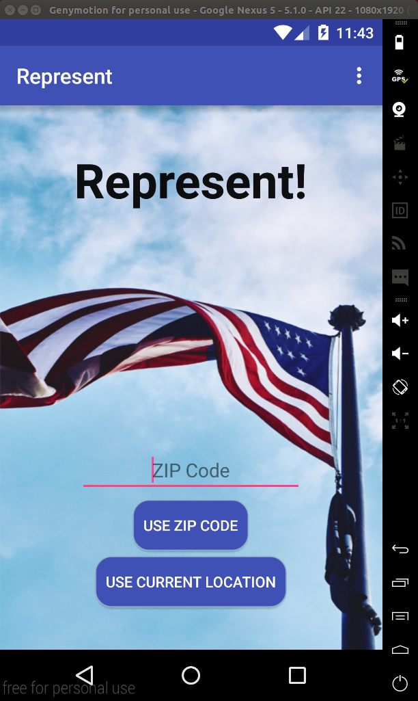
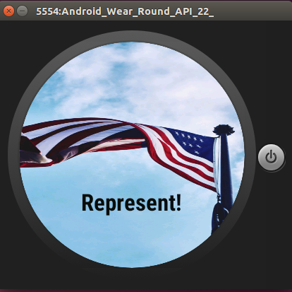

Input errors are handled gracefully

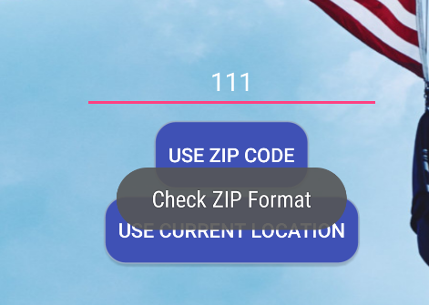
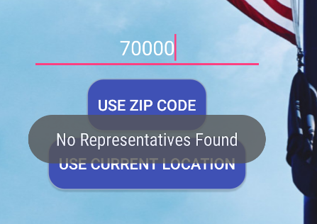

When we select “Use Current Location” the app uses the Google Maps API to get your current ZIP code and we are taken to a new screen.

Since this is the first launch of the app we have to log in with Twitter before we can see any tweets or images.
The phone technically already knows who the reps are but wouldn't be able to display an image so it hides those parts of the layout.

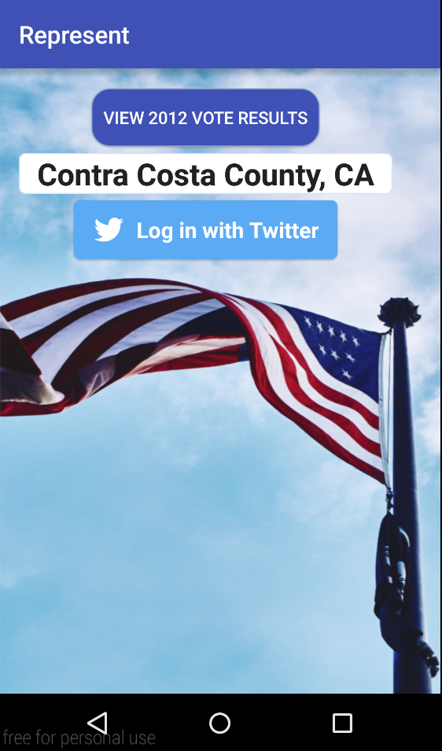
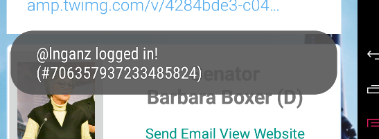

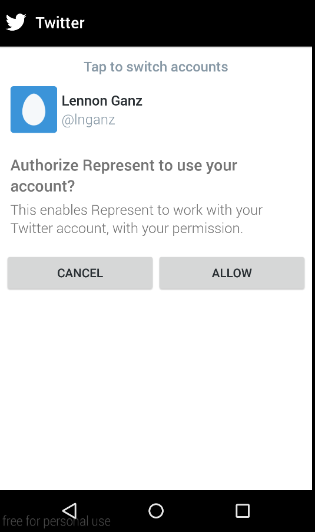

After logging in with Twitter we see their information, images and, most recent Tweets.
The “Send Email” and “View Website” links work as expected.

We can touch the person's image to bring up the detailed view.

The names show up on the watch as well. The user can swipe through the representatives and senators.
Tapping one opens the detailed view on the phone.

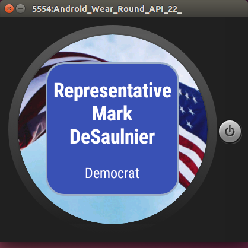
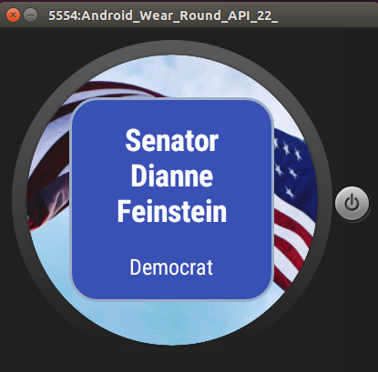

Tapping the "View 2012 Vote Results" button shows you the election results on the watch.
The results are represented both with percentages and the red/blue progress bar.

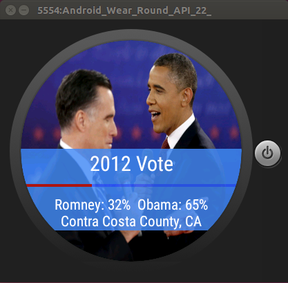

Changing the location (using a ZIP code this time) updates the data on the phone and watch.

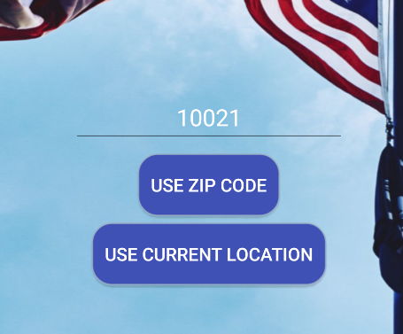

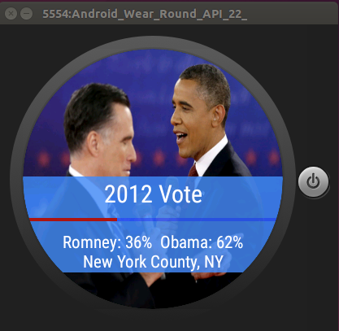

Shaking the watch randomizes our county and updates all the information

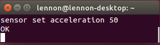
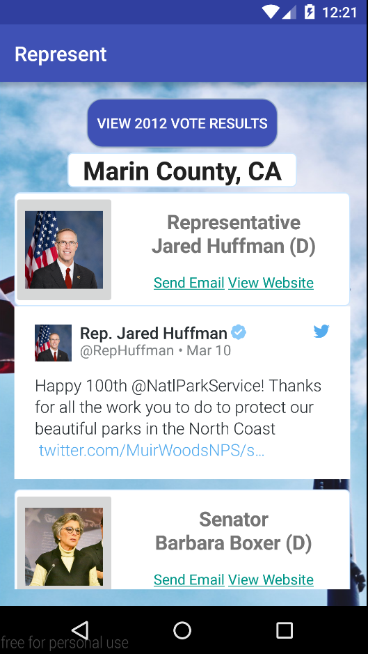
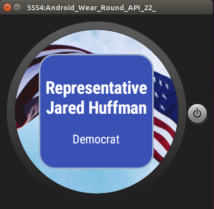

## Acknowledgments

* CS160 Staff